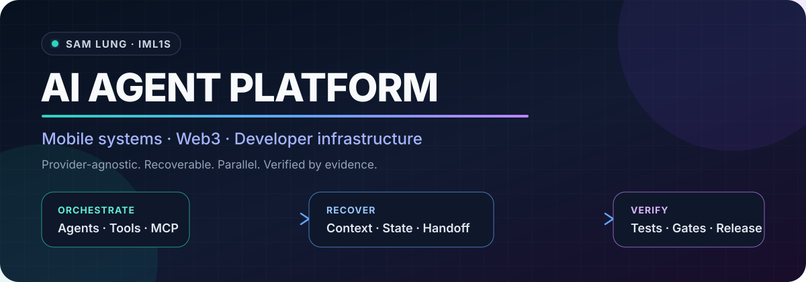

<p align="center">
  
</p>

<p align="center">
  <a href="https://github.com/aa22396584/resume-skills"></a>
  <a href="https://github.com/aa22396584?tab=repositories"></a>
  <a href="https://github.com/aa22396584"></a>
</p>

<p align="center">
  <a href="https://aa22396584.github.io/">Portfolio</a> ·
  <a href="https://www.linkedin.com/in/sam-lung-86ab62191/">LinkedIn</a> ·
  <a href="https://github.com/aa22396584?tab=repositories">Repositories</a> ·
  <a href="https://github.com/pulls?q=is%3Apr+author%3Aaa22396584">Pull requests</a>
</p>

**Why this GitHub account?** Public repositories that used to live under [`ImL1s`](https://github.com/ImL1s) are developed here now because that account is currently restricted (anonymous visitors get 404 on the profile and many assets). These are the same projects. Please open Issues and Pull Requests on the `aa22396584` repositories. Mirrors remain on [GitLab](https://gitlab.com/aa22396584) and [Codeberg](https://codeberg.org/ImL1s).

## What I do

I am a senior software engineer working at the intersection of **AI agent infrastructure, mobile systems, and Web3**.

My current focus is building provider-agnostic developer infrastructure for multi-agent execution: tool orchestration, MCP integrations, context portability, session recovery, human-in-the-loop gates, automated verification, and evidence-backed releases. That work builds on 10+ years of production experience across Android, iOS, Flutter, Kotlin Multiplatform, cross-platform architecture, backend systems, and blockchain-enabled products.

```text
plan → orchestrate agents and tools → preserve context → verify behavior → release with evidence
```

## Selected systems

| Project | Engineering focus |
| --- | --- |
| [**resume-skills**](https://github.com/aa22396584/resume-skills) | Offline, local-only context migration across coding-agent sources and hosts, with bounded readers, inert handoffs, and a registry-derived 81-cell compatibility matrix. |
| [**termux-flutter-wsl**](https://github.com/aa22396584/termux-flutter-wsl) | Repeatable Flutter ARM64 development on Android/Termux, including APK builds, hot reload, and a no-root workflow. |
| [**oh-my-grok**](https://github.com/aa22396584/oh-my-grok) | Multi-agent planning, persistent execution, verification workflows, and CLI orchestration. |
| [**acc**](https://github.com/aa22396584/acc) | A clean-room C compiler written in Rust with multiple architecture backends and repository-backed Linux, SQLite, and Redis validation. |

Other maintained tools include [agent-cli-skills](https://github.com/aa22396584/agent-cli-skills), [charge-pilot](https://github.com/aa22396584/charge-pilot), [flutter_motion_components](https://github.com/aa22396584/flutter_motion_components), [antigravity_for_loop](https://github.com/aa22396584/antigravity_for_loop), and [devclean](https://github.com/aa22396584/devclean).

## Upstream impact

### Merged into external projects

| Project | Contribution |
| --- | --- |
| [tw93/Mole #1154](https://github.com/tw93/Mole/pull/1154) | Protected endpoint-security and EDR agent caches across cleanup and analysis deletion paths. |
| [mobile-dev-inc/Maestro #2909](https://github.com/mobile-dev-inc/Maestro/pull/2909) | Added device and shard environment variables for parallel screenshot E2E workflows. |
| [raullenchai/Rapid-MLX #213](https://github.com/raullenchai/Rapid-MLX/pull/213) | Fixed no-thinking Anthropic streaming behavior with route- and pipeline-level regression coverage. |
| [nyldn/claude-octopus #281](https://github.com/nyldn/claude-octopus/pull/281) | Integrated Cursor Agent CLI as a first-class provider across routing, health checks, diagnostics, and headless execution. |
| [cake-tech/cake_wallet #2770](https://github.com/cake-tech/cake_wallet/pull/2770) | Added complete Traditional Chinese support with Taiwan-specific terminology. |
| [skynetcap/solanaj #37](https://github.com/skynetcap/solanaj/pull/37) | Corrected the public key used when associating SPL tokens. |

<details>
<summary><strong>Active upstream pull requests</strong> — checked 2026-07-28</summary>

<br>

| Project | Proposed contribution |
| --- | --- |
| [biomejs/website #4389](https://github.com/biomejs/website/pull/4389) | Traditional Chinese getting-started documentation and Astro Starlight UI dictionary. |
| [ollama/ollama #17305](https://github.com/ollama/ollama/pull/17305) | Traditional Chinese README and quickstart guide using Taiwan technical terminology. |
| [slopus/happy #392](https://github.com/slopus/happy/pull/392) | Path normalization compatible with Claude Code project naming for reliable session sync. |
| [cake-tech/cake_wallet #2790](https://github.com/cake-tech/cake_wallet/pull/2790) | End-to-end Tron native/TRC20 memo support through transaction construction and signing. |

</details>

[View the complete authored pull-request history →](https://github.com/pulls?q=is%3Apr+author%3Aaa22396584)

## Production background

<details>
<summary><strong>Mobile engineering and Web3 delivery</strong></summary>

<br>

- Technical leadership for Android, iOS, Flutter, and Kotlin Multiplatform products: architecture, code review, native plugins, real-time communication, CI/CD, and store releases.
- Mobile Web3 systems: non-custodial wallets, multi-chain integrations, transaction flows, hardware-wallet interaction, and secure key-management UX.
- Cross-platform delivery across Android, iOS, desktop, Wear OS, watchOS, and Kotlin Multiplatform.
- Backend and platform work spanning Go services, WebSocket/WebRTC communication, SQL data systems, Firebase/GCP infrastructure, and release automation.
- Remote collaboration with engineering, product, and design teams across Asia.

</details>

## Core technologies

| Area | Technologies |
| --- | --- |
| **Mobile & cross-platform** | Flutter, Dart, Android, Kotlin, Jetpack Compose, Kotlin Multiplatform, iOS, Swift, Java, Wear OS, watchOS |
| **Agent & developer infrastructure** | Python, TypeScript, MCP, tool calling, multi-agent orchestration, CLI tooling, context/session recovery, human-in-the-loop verification |
| **Backend & systems** | Go, Rust, C, C++, C#, .NET, SQL, SQLite, Redis, Linux, Bash, WebSocket, WebRTC |
| **Web3** | Non-custodial wallet architecture, Bitcoin, EVM/Web3, Solana, TRON, Wallet Core, transaction signing |
| **Cloud & delivery** | Firebase, Google Cloud, AWS, Docker, GitHub Actions, GitLab CI, App Store and Google Play delivery |

<p>
  
  
  
  
  
  
  
  
</p>

## Current focus

I am interested in **AI Agent Platform / Developer Infrastructure**, **Senior Mobile / Flutter / iOS**, and **Mobile Web3 Systems** roles—especially teams that value architecture, open-source collaboration, and verifiable delivery.

---

## Support

If any of my work has saved you some time, you can [buy me a coffee](https://buymeacoffee.com/iml1s).
